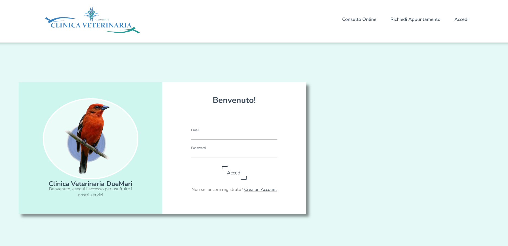
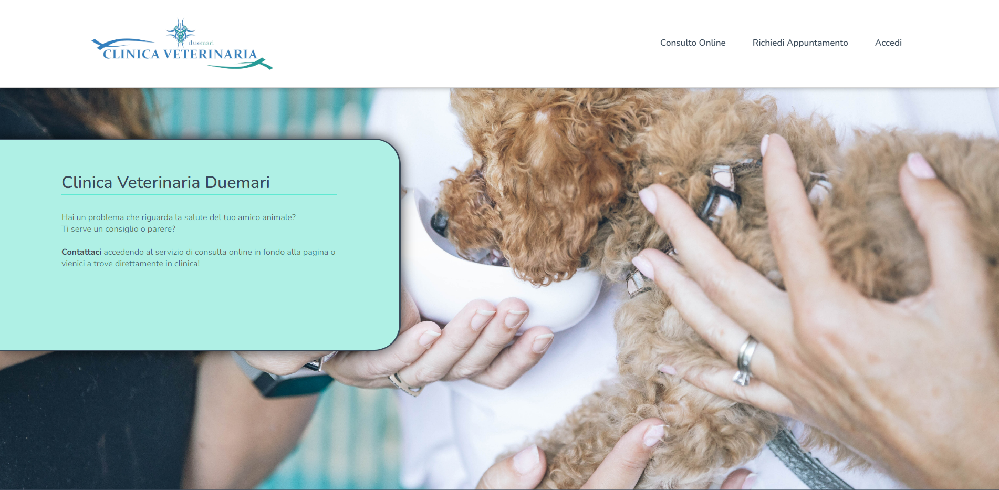
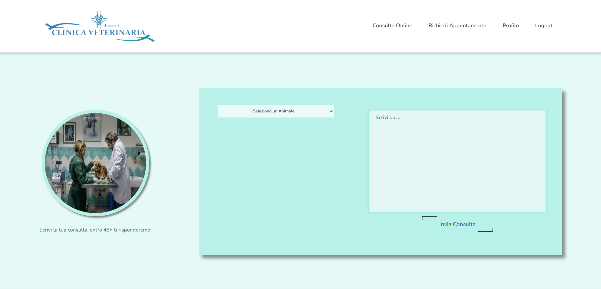
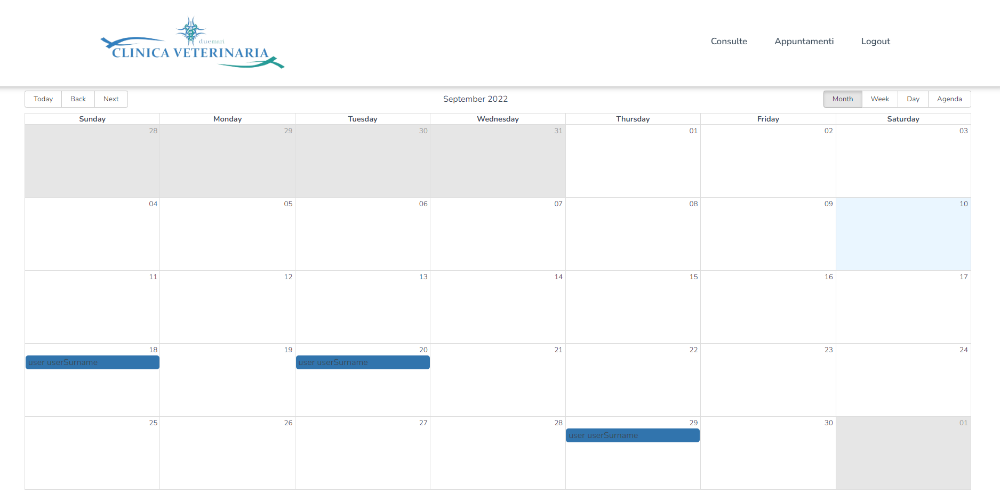

# Toc

- [Toc](#toc)
- [Clínica Veterinaria DueMari](#clínica-veterinaria-duemari)
- [La App](#la-app)
- [Algunas Imágenes](#algunas-imágenes)
    - [Login](#login)
    - [Home](#home)
    - [Consulta Usuario](#consulta-usuario)
    - [Calendario Veterinario](#calendario-veterinario)
  - [Autor](#autor)
      - [Luciano Germani :it:](#luciano-germani-it)

#  Clínica Veterinaria DueMari

*Si lo prefieres pues leer esto en * [Inglés](README.md)

Este proyecto está creado usando **React / Redux / Sass** y apuntando a una base de datos de **MongoDb.** Para poder revisar la BBDD del proyecto puedes hacer clic aquí: [DB CV2 Project](https://github.com/Germanilu/BBDD-CV2).

# La App

En esta aplicación hay **3 roles**, Usuario / Veterinario / Super Admin.

**El usuario** puede registrarse y hacer el login en la aplicación, podrá después registrar una mascota y con ella hacer consultas online o simplemente reservar una cita en la clínica.
**En el encabezado de la aplicación** el usuario puede abrir la tarjeta de su perfil donde podrá revisar sus consultas / sus citas y modificar las informaciones de su perfil.

**El Veterinario** puede hacer el login en la página web y será capaz de revisar las consultas y contestarlas, además, podrá revisar el calendario para ver las citas programadas.

El Super Admin será el encargado de registrar nuevos veterinarios y podrá recuperar toda la información de la página, los usuarios registrados, los veterinarios, las mascotas y todas las consultas. Además podrá también ejercer como veterinario contestando consultas online y revisar el calendario de citas.

El deploy de la aplicación esta hecho en **Aws**, puedes ver la aplicación web aquí:[Clínica Veterinaria Duemari](https://master.d3ga5od2ophbfx.amplifyapp.com/). 

Si te gustaría probar las funcionalidades de cada rol, aquí te dejo unos datos de login:

**Usuario:**
    Email: user@user.com
    Password: 123456!

**Veterinario:**
    Email: vet@vet.com
    Password: 123456!

**Super Admin:**
    Email: admin@admin.com
    Password: 123456!

# Algunas Imágenes

### Login

### Home

### Consulta Usuario

### Calendario Veterinario

## Autor 	

#### [Luciano Germani](https://github.com/Germanilu) :it:

---------------------

[:top:](#toc)

