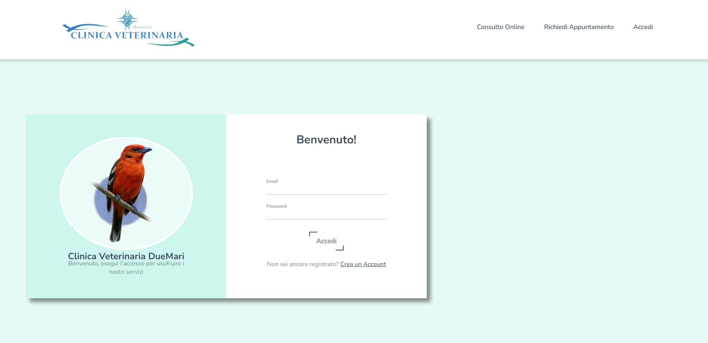
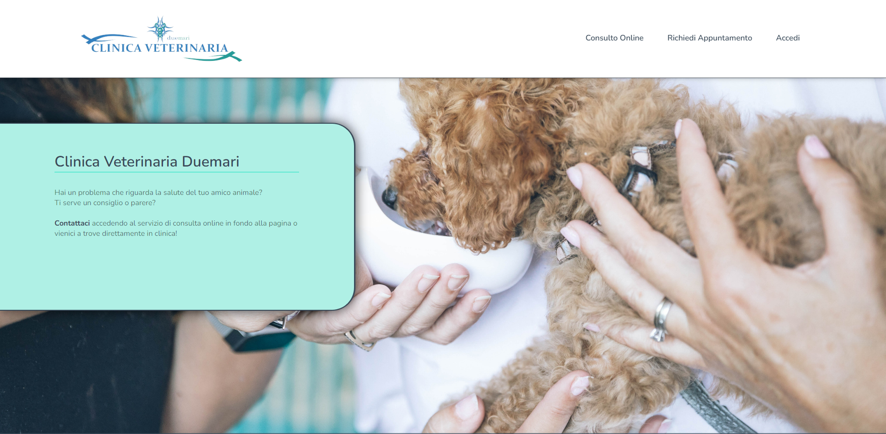
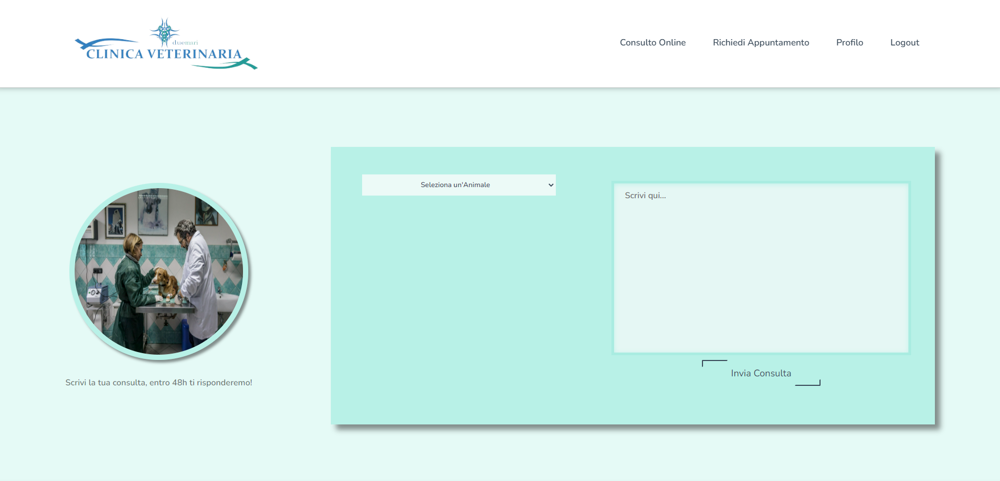

# Toc

- [Toc](#toc)
- [Clinica Veterinaria DueMari](#clinica-veterinaria-duemari)
- [The Application](#the-application)
- [Some Images](#some-images)
    - [Login](#login)
    - [Home](#home)
    - [User Consult](#user-consult)
    - [Vet Calendar](#vet-calendar)
  - [Author](#author)
      - [Luciano Germani :it:](#luciano-germani-it)

#  Clinica Veterinaria DueMari

*If you prefer you can read this in* [Spanish](README-ESP.md)

This project was made using **React / Redux / Sass** and aiming to a **MongoDB** Database. **This is a Full Stack Web Application,** To check the back-end project you can click here : [DB CV2 Project](https://github.com/Germanilu/BBDD-CV2).

# The Application

In this application, there are **3 roles**, User / Veterinary / Super Admin.

The user can complete a registration form and make the login to be able to register a pet and request an online consult or also, book an appointment with the clinic. 
**A profile card is visible in the user header** where he can check his appointment / consults and also edit his profile information.

**The Veterinary** can login into the website and will be able to manage and reply to the consults made from the client and to check the appointment on a calendar.

**The Super Admin** will be able to register a new Veterinary and retrieve all the data regarding the users, pets, veterinary and also check all the consults. Apart from this, the Super Admin can reply to the user consults like a Veterinary.

This application is deployed in **Aws,** you can see the website here: [Clinica Veterinaria Duemari](https://master.d3ga5od2ophbfx.amplifyapp.com/).

**If you would like to try the functionality of each role, here below you will find all the logins**

**User:**
    Email: user@user.com
    Password: 123456!

**Veterinary:**
    Email: vet@vet.com
    Password: 123456!

**Super Admin:**
    Email: admin@admin.com
    Password: 123456!

# Some Images

### Login

### Home

### User Consult

### Vet Calendar

## Author 	

#### [Luciano Germani](https://github.com/Germanilu) :it:

---------------------

[:top:](#toc)

